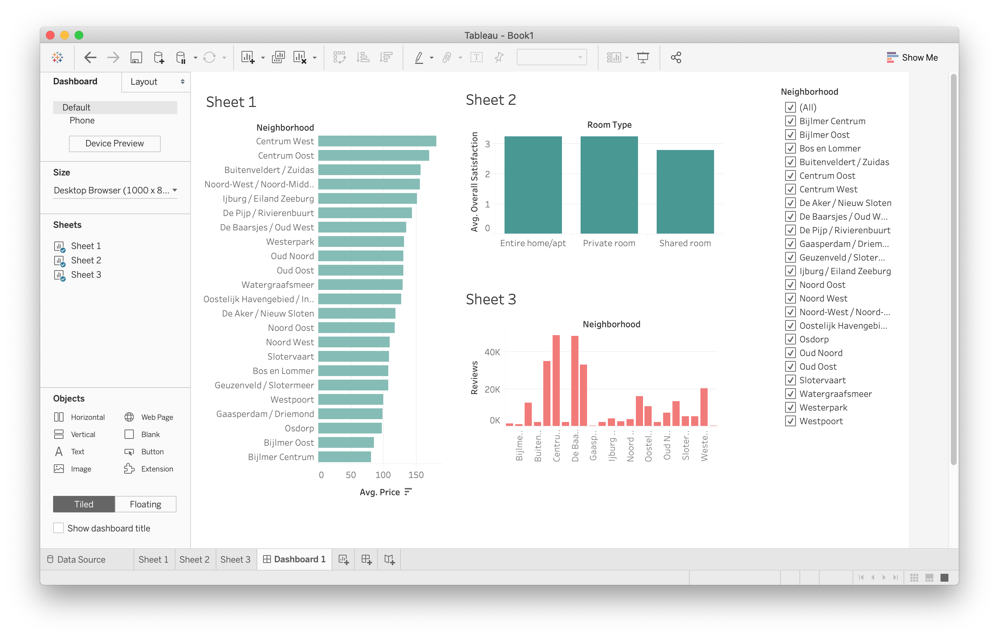

# Exploring Airbnb accommodations in Amsterdam

## Further features of a dashboard

### 1) Use As Filter

We can select a sheet inside of the dashboard, and using the funnel icon can set this sheet as the filter for the entire dashboard. Clicking around the different components of the filter sheet will change the output of all other sheets included in the dashboard.