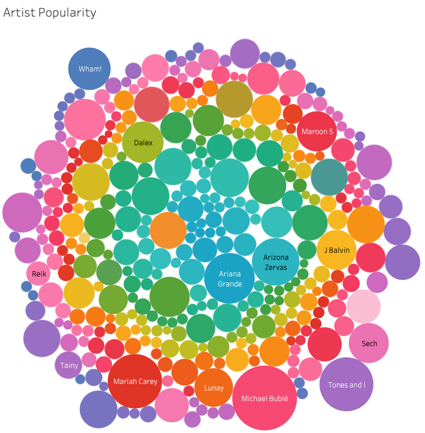
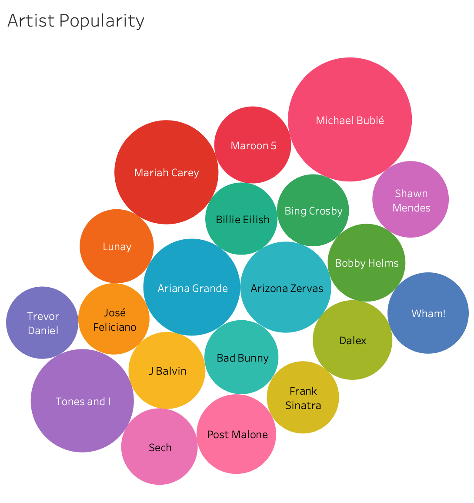
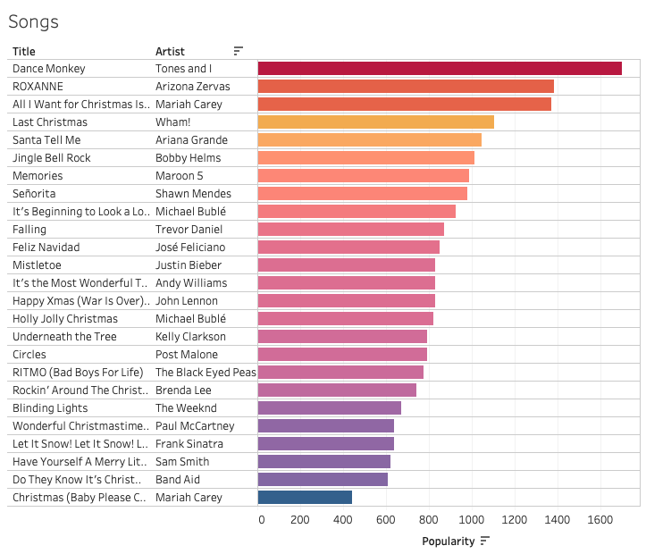
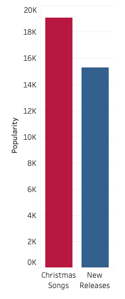

# Exploring Top 50 Music Charts

The dataset visualized contains the Top 50 songs of selected countries worldwide during December 2019.

#### Data Visualization with Tableau

Let's first take a look at who people around the world listen to for getting into the holiday spirit. Here are all of the artists included in the data set:

A little overwhelming, so let's narrow it down to the 30 most popular artists:

 At first glance, it looks like a somewhat even split between artists best known for their Christmas songs, and the latest ones to conquer the top of the charts regardless of the season. But, artists expected to be in the charts for new releases could also have recorded some festive tunes in the past, so let's check out the specific titles at the top of the list:

In order to compare the popularity of Christmas songs and new releases, we separate them into two groups and can conclude that Christmas is dominating amongst the most popular songs of this dataset:

