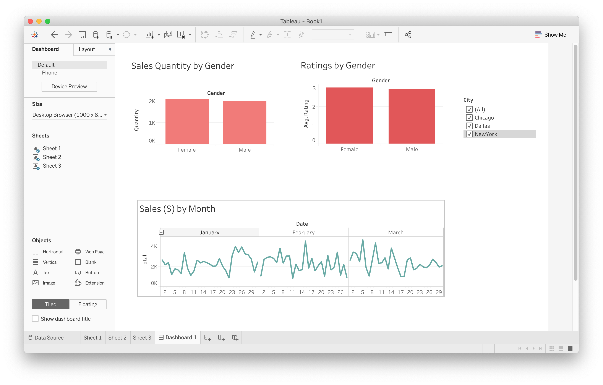

# Supermarket

Exploring sales at three different supermarket locations

## Dashboards in Tableau

A dashboard is an interactive tool that can be used to combine different worksheets and compare them to each other.

## Basics

There are three different file types that can be worked on in Tableau:

- Sheet
- Dashboard
- Story

In order to create a dashboard, we will need sheets to fill it with.

## Sheets

Let's create a few simple sheets:

- Drag values into the 'Columns' and 'Rows' fields

- Choose a value as filter and drag it in the 'Filters' box

- Hover over the value field and click the down arrow

- Check 'Show Filter' to display interactive filter in worksheet

- Hover over 'Apply to Worksheets' and select 'All Using This Data Source'
    - This step is important to link the worksheets together in the dashboard

Here are some sheets created following the above steps:

#### Sheet 1

#### Sheet 2

#### Sheet 3

For datasets with dates, the date dimension can be broken up into years, quarters, months, and days, whatever makes the most sense in the specific context.

## Dashboards

Now that we have a few sheets, we can open a new dashboard and add our sheets.

Dragging the sheets into the dashboard while holding the 'shift' key will insert the sheets as floats which will make it easier to adjust them.

Since we applied the respective filters for each sheet to all other sheets using the same data source, when we play around with the filter legend all graphs will change.
