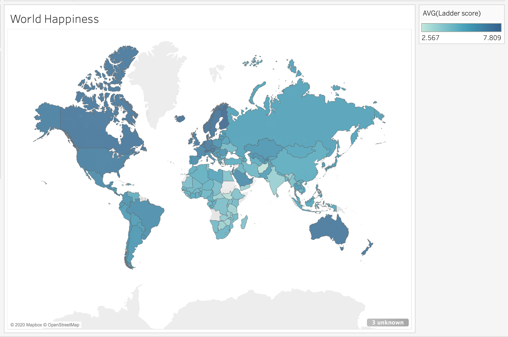
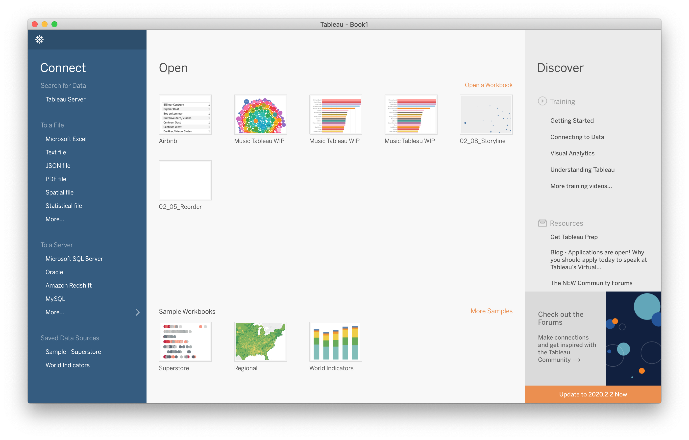
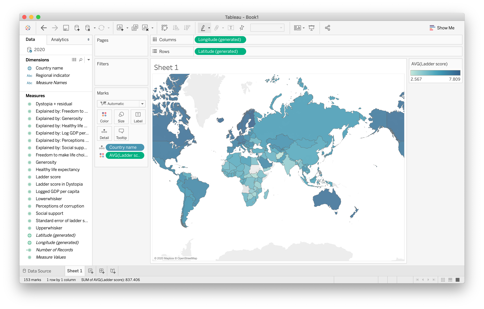

# Exploring World Happiness Report

The dataset visualized contains the Happiness Score for 153 countries measured with the Centril Ladder.

## Data Visualization with Tableau

Tableau has a neat feature for datasets containing geographical information which can be used to create a world map. The different shades on the map correspond to values on the legend to the right of the map.

### Connecting Tableau to Data

Upon opening Tableau Desktop we will see the following window:

In order to connect to a data source, on the left hand side select file type and browse for file

#### Maps Feature

To create this map: 
- Drag the dimension 'Country Name' to Columns 
- Drag the measure 'Ladder Score' to Rows

To get the world layout:
- Open 'Show Me' on the very right and select 'maps'. 

Lastly, change the measure of 'Ladder Score' from SUM to AVG:
- Hover over 'AVG(Ladder Score)' in the 'Marks' box
- Click the down arrow and change the measure type.

